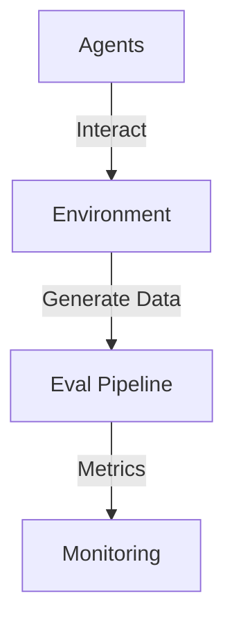

# Architecture Overview: [System Name]

## High-Level Components
- **Agents Layer**: [e.g., Autonomous modules using Actor model]
- **Environment Simulator**: [e.g., Event-driven with Kafka for state changes]
- **Eval Data Pipeline**: [e.g., ETL with Apache Airflow]

## Design Patterns
- **Core**: [e.g., BDI for agents, Saga for multi-agent coordination]
- **Scalability**: [e.g., Horizontal scaling via containers]
- **Resilience**: [e.g., Circuit breakers for agent failures]

## Tech Stack
- **Languages/Frameworks**: [e.g., Python with Akka-like for agents]
- **Data**: [e.g., MongoDB for agent states, S3 for eval datasets]
- **Deployment**: [e.g., Serverless on AWS Lambda for eval gen]

## Diagrams

## Trade-Offs
- [e.g., Monolith vs. Microagents: Favor modularity for evolvability]

## LLM Prompt for Generation
- [e.g., "Generate Mermaid diagram from components"]

## Version History
- **Version**: [1.0]
- **Date**: [YYYY-MM-DD]